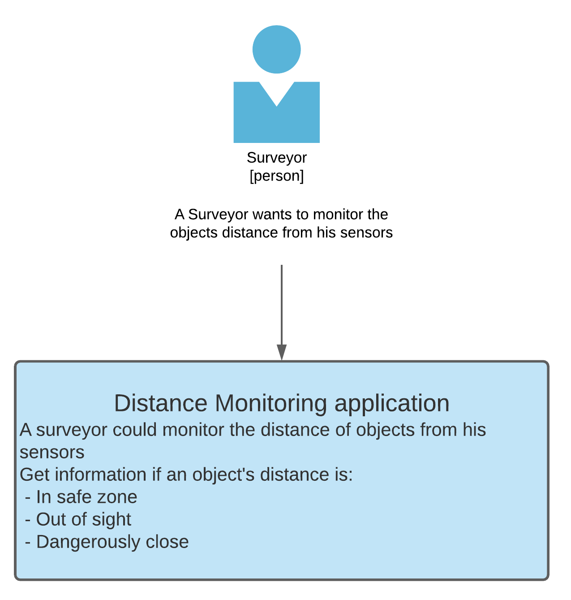
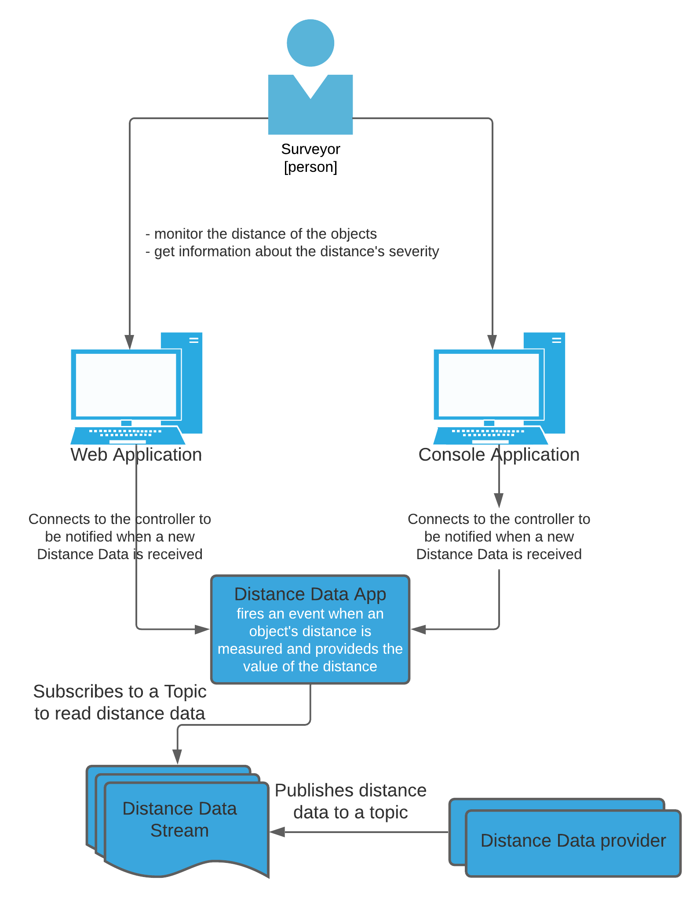
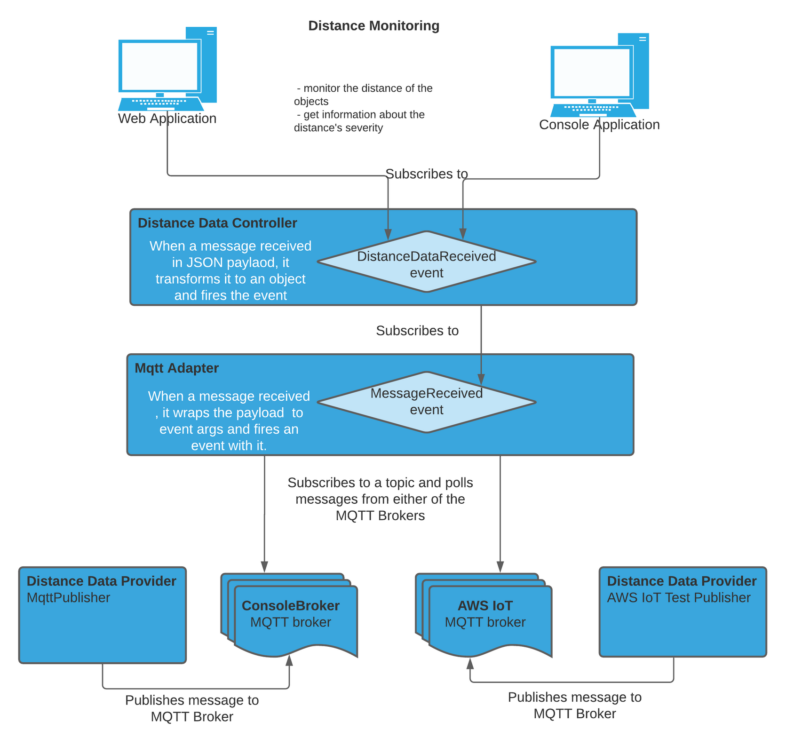

# DistanceMonitoring
DistanceMonitoring 1.0

## Context

## Containers

## Components

## Code

### Implementation Details

.Net Core (5.0) Console Application, implemented in C#, using Visual Studio 2019.

#### DistanceMonitoring

##### ConsoleBroker

A simple console application to start an MQTTnet broker. It runs on localhost at port 1884, and currently this could be changed only from the application code.

##### DistanceMonitoring

A hosted console application that uses Microsoft DI to inject the required components and to pull the configuration from the `appSettings.json` configuration file

***Configuration***

The application required configuration values are stored in the `appSettings.json` file and it is being parsed and mapped to an `AppConfig` object at application startup. 
The `IConfigProvder` interface defines the necessarry methods to retrieve the configuration information. The application configuration has 2 main sections, for the 2 different MQTT adapters:
 - AWSIoT
 - MQTT

***Controller***

The `IDistanceDataController` requires an `IMqttAdapter` and provides a `DistanceDataReceived` event that can be used to subscribe to newly received `DistanceData`;
It uses the `IMqttAdapter` through its public event to receive new messages from the MQTT broker.

***Adapters***

MQTT Adapters are used to connect to different MQTT brokers and subscribe to a topic to receive messages published to it.
Available MQTT adapters, that implement the `IMqttAdapter` interface are:
 - AWSIoTAdapter
 - MqttAdapter

The adapters wrap the implementation of establishing a connection to the brokers for a specific topic, closing connecting, handle new messages and forwarding them via an event.
The required configurations for the adapters are fetched from the `appSettings.json` configuration file by the `IConfigProvider`, mapping the config sections to objects as well.

***Model***

The `DistanceData` represents the message type that is being transferred as a JSON payload on the message brokers, and it is being serialized/deserialized when publishing/reading from the broker's topic.

***View***

The `DistanceMonitor` is responsible for starting the monitoring by subscribing to the `DistanceDataController`'s `DistanceDataReceived` event and unsubscribing the it stops monitoring. 
When the `DistanceData` is received it is used to identify the severity of the distance value and print it on the console.

##### MQTT Publisher

This standalon project is used to connect to the MQTT broker started by the ConsoleBroker and to simulate data publishing to a specific topic. Similarly to the ConsoleBroker, the address, port number and topic of the broker is configured in the application code currently. 

### DistanceMoniorTests

This project contains a few tests to test the end to end functionality of the DistanceMonitoring project.
The tests mock the `IDistanceDataController` and the `IMqttAdapter` and fire mocked events to simulated the message streaming and event propagating behaviour of the application.

### Notes, considerations

 - To be able to test the application, the `ConsoleBroker` and the `DistanceMonitoring` projects should be started at the same time. 
 - The application could connect to only one broker at a time, and it should be configured at the `Startup.cs` when adding services in the DI section.
 - The application runs as a console app and shuts down when a Ctrl + C key is hit.
 - There is no logging in the imlpementation currently, but NLog could be easily added to the project.
 - The `ConsoleBroker` and the `MqttPublisher` projects should use a seprate configuration file, instead of using harcoded values for the broker connection details.
 - The solution contains tests, but only end-to-end test, mocking out the external dependencies. Further unit tests could be added to test the smaller code parts.
 - Exception handling, input validation and error handling could be further improved accross the code.
